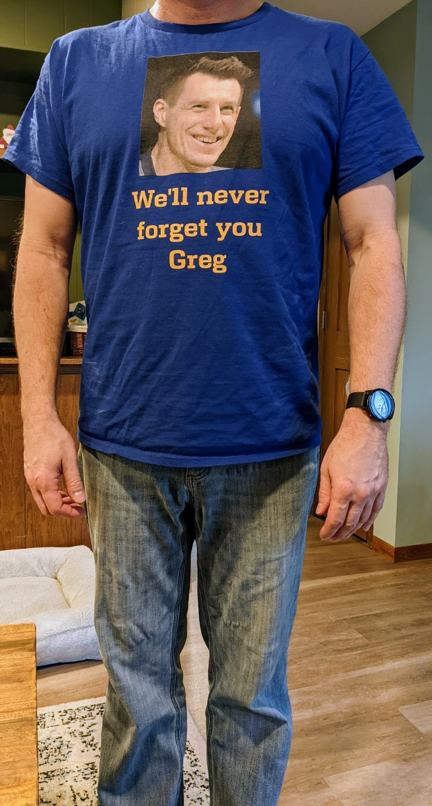

Honk, honk!  On July 9tth 2021 Cyber Goofpal was born in the crucible that was a Brew Crew Ball game thread.  A new commenter (who commented with great aplomb) lashed out at the BCB regulars, calling them Cyber Goofpals and viola, a character was born.

In the following years Cyber Goofpal provided his keen insight to all things Brewer baseball on BCB.  Cyber Goofpal’s progeny, (henceforth the “little Goofpals”) thought that he should offer his insights on other things, as well as have a repository of writings in the event that Vox shuts down BCB (FT).  This is that site. 

There is a comments section on each article, so feel free to post kind (or at least “internet-kind”) items.  Please refrain from political posts.  If you’d like to get your right or left-wing ya-yas out there are plenty of places to offend the other side, or have everyone in your echo-chamber agree with your brilliance. 

If you have article ideas, or want to message me for any reason, I can be reached at cybergoofpal@gmail.com

I know you have a great many choices on how to mindlessly waste time on the internet so I’m glad you chose this nonsense to amuse you.  Hope you enjoy it.

